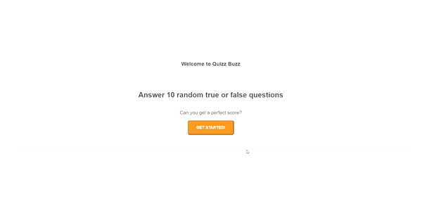

# Quiz-Buzz

A React/Typsescript Quiz App centered on computer science related questions.

# Technologies
The following technologies were used in the production of Book Collection:

- React 17.0.1
- React-Dom 17.0.1
- React-Router-Dom 5.2.0
- React-Scripts 4.0.1
- Typescript 4.1.3

# Features
Quiz Buzz has the following features implemented:

A random set of 10 questions of varying difficulty related to Computer Science.
Answers are in True/False format.

# Installation:

On a local machine:

- Clone this Repo
- Run 'bundle install' from the root directory
- Run 'npm start'
